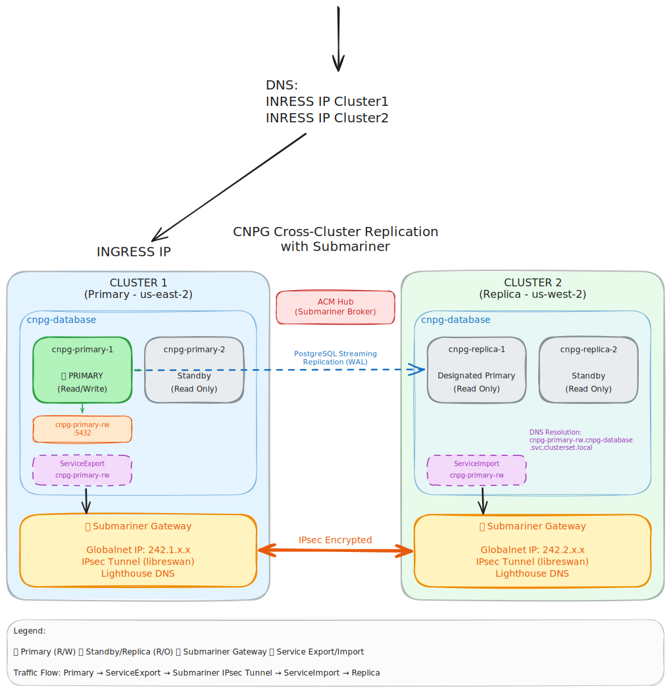

# Submariner Demo

Cross-cluster PostgreSQL replication on OpenShift using Submariner and CloudNativePG (CNPG).



## Prerequisites

- AWS credentials in `.env`
- OpenShift installer
- `kubectl` / `oc`
- OpenShift pull secret in `pullsecret`

## Quick Start

```bash
# Create both OpenShift clusters (us-east-2 and us-west-2)
make create

# Deploy Submariner with Globalnet
source .env
make submariner-deploy

# Deploy CNPG primary (cluster1) and replica (cluster2)
make cnpg-deploy
```

## Usage

```bash
# Check status
make submariner-status
make cnpg-status

# Add an entry on primary and verify replication
make add_entry
make show_entries

# Test cross-cluster connectivity
make cnpg-test
```

## Cleanup

```bash
make cnpg-delete
make destroy
```
